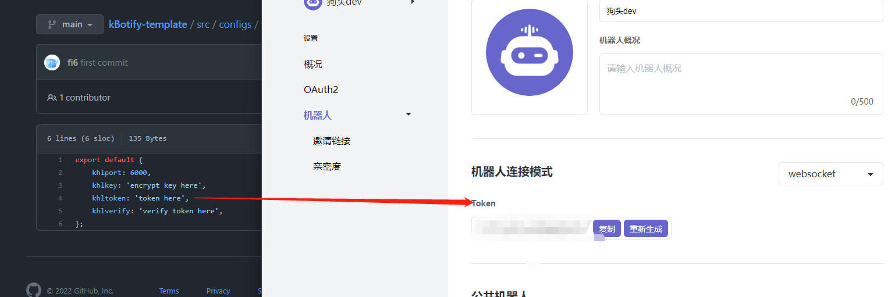
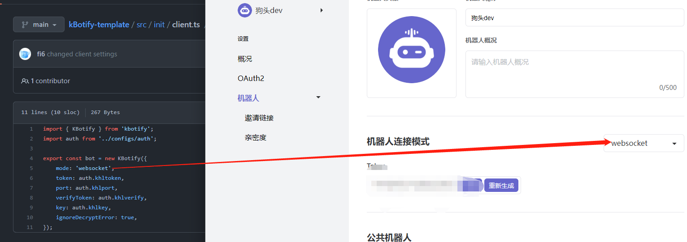

# kbotify-template
Starter kit for kBotify bots

## Quick Start Guide
1. Create a `auth.ts` under `.../src/configs`, using the template in `template-auth.ts`. Replace the security strings based on your bot.
e.g.: 
2. Make sure the mode in `.../src/init/clients.ts` is consistant with your bot's mode. 

3. Under kBotify-template (the directory that you see package.json and package-lock.json), run `npm install` in console. 
4. Run `npm start` in console under the same directory as step 3. If you have `Cannot find module 'ts-node/register'` error, see [this page](https://bobbyhadz.com/blog/typescript-cannot-find-module-ts-node-register#:~:text=If%20you're%20still%20getting,package%20in%20the%20devDependencies%20object.&text=Copied!,-%7B%20%22devDependencies%22%3A&text=You%20can%20try%20to%20manually,and%20re%2Drun%20npm%20install%20.) to troubleshoot.
5. Then your bot, which should be already added to your server, should go online now.
6. Send `.echo` in your Kaiheila channel like a regular chat message; the bot will respond you.